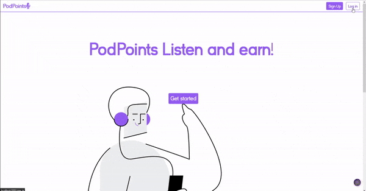
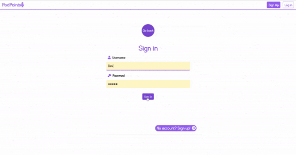
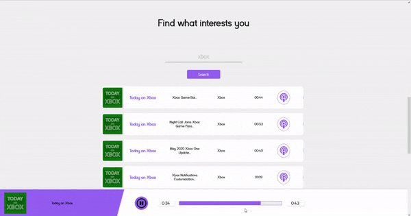
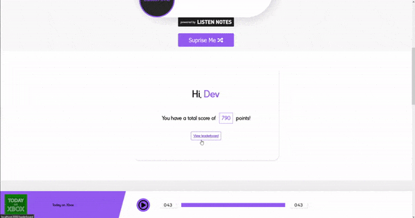

## PodPoints

### Setup
Note: Make sure to clone the pod-points-api repo found [here]("https://github.com/SNasser97/pod-points-api") 

1. `clone the repos` 
2. `npm install`
3. `npm run start / npm start`

### About

  Pod points is a fullstack web project developed by me using the Listen Notes API (of course with the help of google and documentation!) built throughout whilst being in quarantine.

  This personal project was developed so that I can apply what I have learnt following ZTM Course.

### Tools/packages used
* [React]("https://create-react-app.dev/")
* [Redux]("https://redux.js.org/") (state management)
* [react-router]("https://reactrouter.com/")
* [redux-thunk]("https://www.npmjs.com/package/redux-thunk") - (handle async dispatch)
* [react-media-player]("https://github.com/souporserious/react-media-player")
* [react-reveal]("https://www.react-reveal.com/")

## How it works

### 1. Sign up.

### 2. Search for an episode or get a random episode to listen to

### 3. Earn points for finishing the episode!

### 4. Check the leaderboard to see where you rank!

